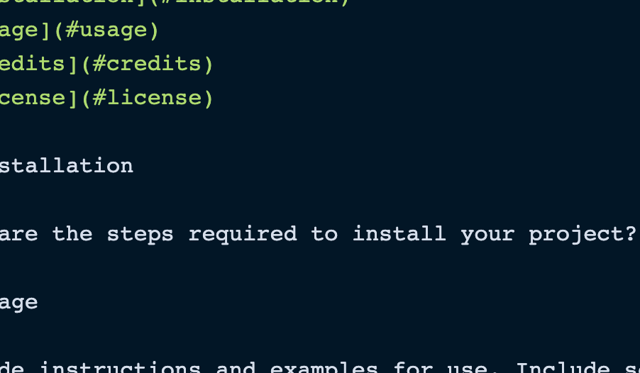

  # Who Let My Dawg Out

  ## 

  ## TABLE OF CONTENTS
  * [Description](#description)
  * [Installation](#installation)
  * [Usage](#usage)
  * [Contributors](#contributing)
  * [Tests](#tests)
  * [FAQ](#questions)

  ## DESCRIPTION
  Our team has created a nice tool for any dog-owner. Its perfect for looking up local resources for pet owners and dog walkers ����‍♀️.

A user can visit this website and type in the name of a city and choose what type of resource they are interested in. Once the user presses submit, an interactive Google Maps window will appear on screen to show the selected resources that are near the requested city. For those who are thinking about taking their dog for a walk, a box displaying the weather will appear to let you know what its like outside currently at that location.

  ## INSTALLATION
  It is available on your browser with a downloadable app in production.
  
  ## CONTRIBUTING
  Patrick, Shep, Scott, and Akarim.

  ## TESTS
  We didn't run any tests but if we had they would be here.

  ## USAGE
  

  ## FAQ
  * shadin@alarab.com
  * https://github.com/shadin-a
  * Feel free to reach me via my carriar pigeon, Hank.

  # LICENSE
  
  Licensed by https://opensource.org/licenses/MIT
  
  